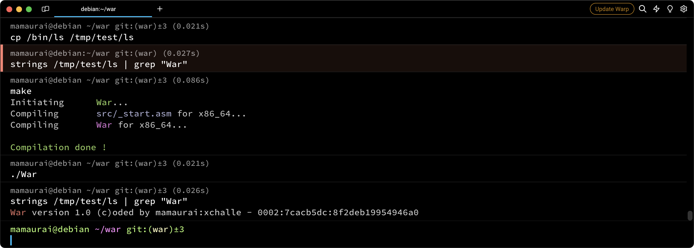
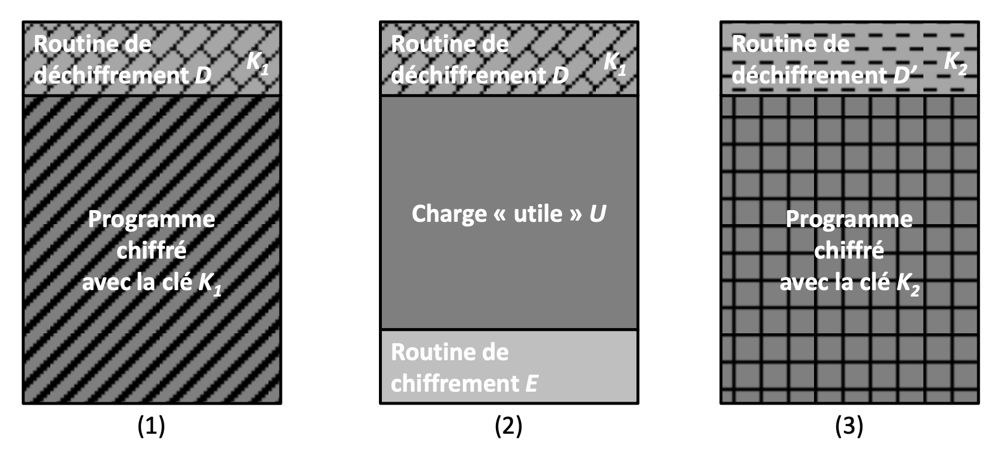
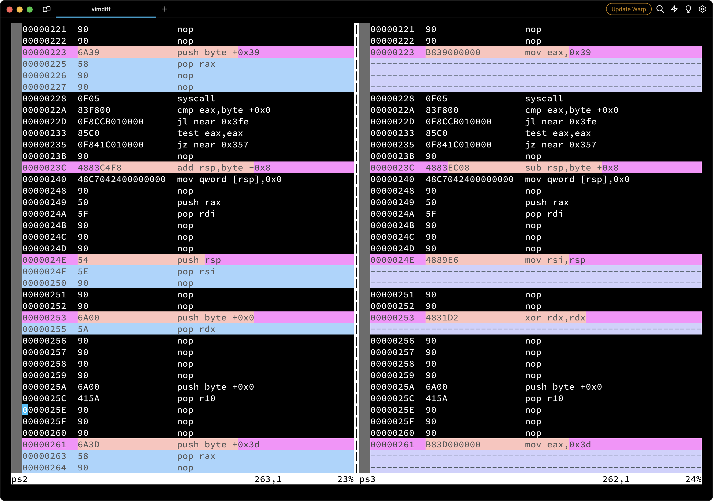
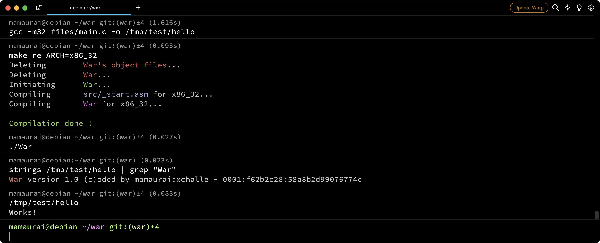
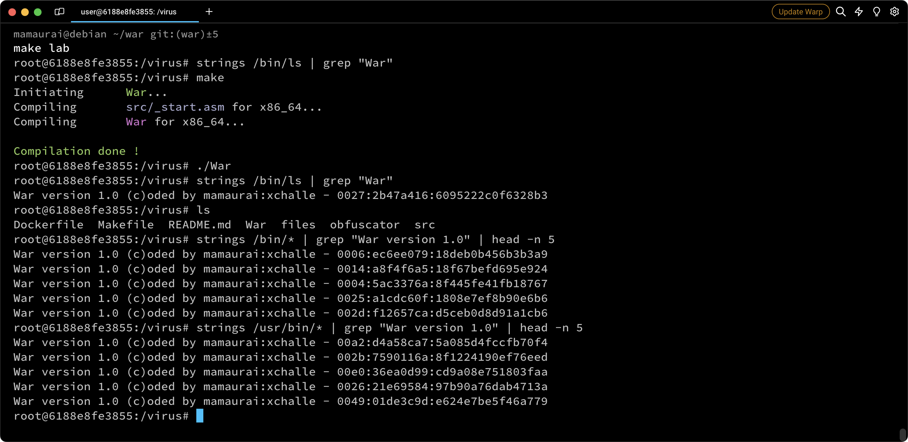
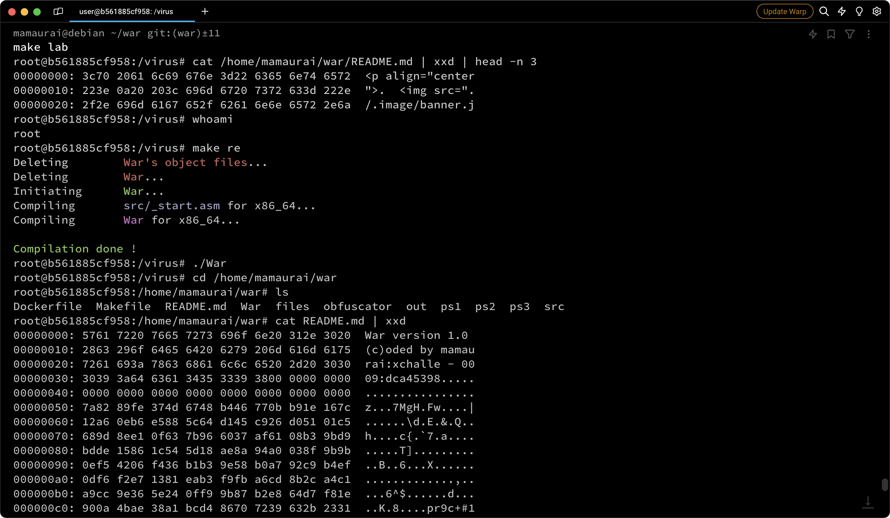
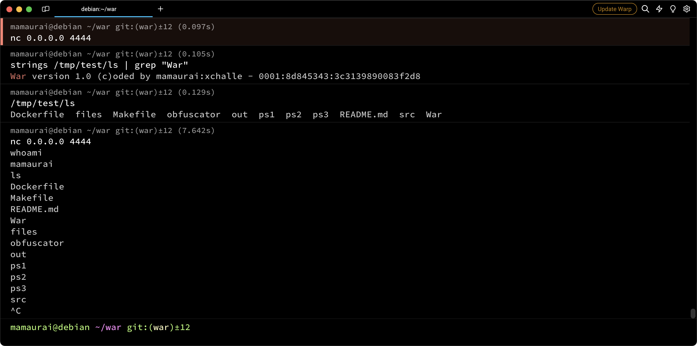
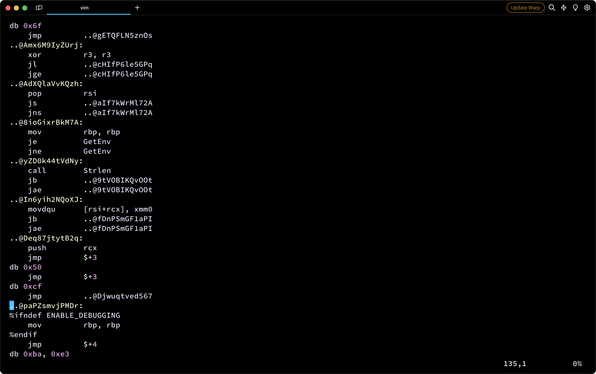

<p align="center">
  
</p>

---
<p align="center">
    
    
    
    
    
    
</p>


> A Simple Polymorphic Linux ELF virus designed to change it's own signature at every duplication.

## 📝 Table of Contents

* [⛔️ Warning](#-warning)
* [❓ What is it](#-what-is-it)
* [⚙️ How it works](#-how-it-works)
* [⭐ Bonus features](#-bonus-features)
* [📋 Prerequisites](#-prerequisites)
* [🔧 Install](#-install)
* [🚀 Usage](#-usage)

## ⛔️ Warning

The sharing of this project on my GitHub aims to help peoples to open their minds to new logics or help peoples in case of difficulty. In no way, that aims to copy and paste this work on your own repository.

This executable can do great damage to your computer if it is run, I strongly recommend that you run it in a separate and secure environment away from your personal data.

## ❓ What is it

This project is a direct improvement of the previous viruses [Pestilence](https://github.com/mathias-mrsn/pestilence) and [Famine](https://github.com/mathias-mrsn/famine). War requires us to create a virus capable of hiding itself from antivirus programs by using polymorphic techniques. War builds upon the features implemented in the previous viruses, so I highly recommend reading [Pestilence README.md](https://github.com/mathias-mrsn/pestilence/blob/master/README.md) and [Famine README.md](https://github.com/mathias-mrsn/famine/blob/master/README.md) to understand what is incorporated into Pestilence.

This project aims to create an ELF executable that can embed its own code within a target file. In our case, our target is not a single file but two directories for the mandatory part. Those directories are `/tmp/test` and `/tmp/test2`. To consider a file "infected," the file must contain the virus code that we have coded. It should be executed by the file when you run it without altering its original behavior and without printing anything. Otherwise, our virus would be detected.

After being infected, the targeted file will contain a `signature` in this form: `War version 1.0 (c)oded by mamaurai:xchalle - 0000:11111111:2222222222222222`, where `0000` is just an index to determine the infection order of each process, and `11111111` is the beginning of an encryption key used to encrypt the malicious payload every time the program is duplicated. The last part `2222222222222222` is the new part of this signature, composed of 16 bytes.

This part of the signature is created by taking the first 32 bytes of the modified code at the `_virus` pointer, XORing it with the next 32 bytes, then XORing the result with the subsequent 32 bytes, and continuing until reaching the `_decrypt` pointer. If the binary code hasn't changed, this part of the signature must remain the same. However, in our case, since we implement a substitution instruction engine, the binary code of the decryptor will always change, and so will the signature.

<p align="center">
  
</p>

War inherits features from [Famine](https://github.com/mathias-mrsn/famine) and [Pestilence](https://github.com/mathias-mrsn/famine), such as debugger detection, conditional execution, root infection, etc. I highly recommend reading the README.md of those two projects to understand what's inside this one.


## ⚙️ How it works

For this project I won't explain the mutation engine because this one is shared with the death project that aims to create this metamorphic engine. To understand how it works I recommand you to take a look to our [Death](https://github.com/mathias-mrsn/death) project, where you can find a full explaination.

Instead I will quickly explain what is a polymorphic virus.

<p align="center">
  
</p>

This schema is a perfect explanation of what polymorphic code is. Polymorphism aims to address the weaknesses of the classic `oligomorphic` viruses. While simple encryption works, it has a significant vulnerability: the decryption routine remains the same regardless of the number of previous encryptions. This weakness makes malware detection straightforward for antivirus programs. That's why, in the 90s, the first polymorphic viruses were created. The goal is to alter the shape of the decryption routine with each duplication, making it less detectable by antivirus software.

To observe variations between two infected files, here are a few commands to run:

```bash
$ FILE=file1; PATERN=War; LINE=1000; grep -obUaP "$PATERN.*" $FILE | cut -d: -f1 | xargs -I {} sh -c "ndisasm -b 64 $FILE -e{}" | head -n $LINE > file1

$ FILE=file2; PATERN=War; LINE=1000; grep -obUaP "$PATERN.*" $FILE | cut -d: -f1 | xargs -I {} sh -c "ndisasm -b 64 $FILE -e{}" | head -n $LINE > file2

$ vimdiff file1 file2
```

<p align="center">
  
</p>

## ⭐ Bonus features

This project opens the door to many potential bonuses. For this project, we have decided to implement six bonus features:

<details open>
<summary><b>32 Bits Compatibility</b></summary>
<br>

We decided to leverage the wide possibilities of NASM preprocessing to create a coding approach that works on both 64-bit and 32-bit architectures. Here is how assemble it for 32bits:
```shell
$ make ARCH=x86_32
$ ./War
```

<p align="center">
  
</p>
</details>

<details open>
<summary><b>Root Infection</b></summary>
<br>

At the beginning of the infection routine, the virus will query the kernel for the UID to determine whether the executable has been run with root privileges or via sudo. If the UID is greater than zero, the virus will only infect `/tmp/test` and `/tmp/test2`, as explained above. However, if the UID is zero, indicating root privileges, the virus will infect the following directories: `/bin`, `/usr/bin`, `/usr/local/bin`. Subsequently, almost all executables on the machine will be infected and capable of infecting other files. For example, if you run `ls` as root in the `/home` directory, the resulting subfiles will be infected, potentially leading to the corruption of personal files with our signature.

<p align="center">
  
</p>
</details>

<details open>
<summary><b>Non-Binary Infection</b></summary>
<br>

As mentioned above, if the virus is executed as root in the `/home` directory, it will infect non-binary files. In this project, the infection involves placing the virus signature at the top of every file and encrypted the entire file with an AES-256 encryption algorithm.

<p align="center">
  
</p>
</details>

<details open>
<summary><b>Packer</b></summary>
<br>

Our virus implements a packing algorithm called `lzss`. This algorithm is designed to minimize the size of the virus within the targeted ELF. The code will be unpacked during runtime. The algorithm is lossless and relies on the repetition of patterns within the code.
</details>

<details open>
<summary><b>Backdoor</b></summary>
<br>

To make our virus even more impactful, we decided to implement a backdoor routine. This routine is executed after decryption and is designed to initiate a malicious process on your machine, which can be highly advantageous for an unauthorized person seeking access or to exploit your machine for financial gain.

The backdoor routine is a reverse shell, the virus will open a port in a separate process and listen for incoming requests on this port. Each request sent to this port will be redirected to a bash process, creating a reverse shell with the same privileges as the executor.

<p align="center">
  
</p>

</details>

<details open>
<summary><b>Full Obfuscation</b></summary>
<br>

To continue beyond Pestilence, we decided to retain the complete obfuscation of our code, as implemented in the previous virus. This is done to make our code difficult to understand, even for someone who can bypass the antidebugging checks.

<p align="center">
  
</p>
</details>

## 📋 Prerequisites

- `make`
- `nasm`
- `ld`

## 🔧 Install

```sh
$ git clone https://github.com/mathias-mrsn/war.git
```

## 🚀 Usage

```sh
# Run it in secure environment
$ cd war
$ make
[...]
$ (sudo) ./war
```

## 👥 Authors
- [@mathias-mrsn](https://github.com/mathias-mrsn)
- [@xchalle](https://github.com/xchalle)
